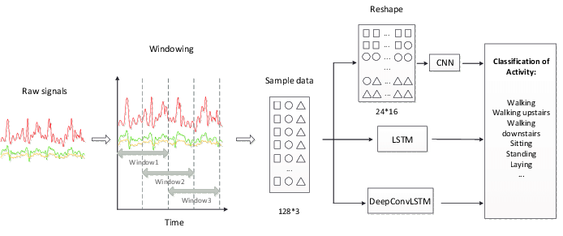

<h1 align="center">Human Activity Recognition Using Pure Python</h1>

  

---

## Overview

Human Activity Recognition (HAR) is a project aimed at detecting and classifying human activities from mobile sensor data using deep learning techniques.

---
## Problem Statement:

Human Activity Recognition (HAR) is a significant area of research aimed at detecting and classifying human activities based on sensor data collected from wearable devices such as smartphones or smartwatches. The goal is to develop algorithms that can accurately identify different activities performed by individuals, such as walking, running, sitting, standing, etc., based on the patterns present in the sensor data.

## Implementation Details:
To implement the HAR project, I have developed a custom neural network structure entirely from scratch using pure Python code. This approach eliminates the dependency on external libraries or frameworks and allows complete control over the model architecture and optimization process.

The custom neural network architecture includes layers for data input, fully connected (dense) layers, activation functions (such as ReLU), and optimization algorithms (such as Adam, SGD, and Adagrad). The model is trained using backpropagation and gradient descent techniques to minimize the loss function and optimize the model parameters.

By implementing the neural network from scratch, I aim to deepen my understanding of deep learning concepts and algorithms while providing a flexible and customizable framework for human activity recognition tasks.

## Tools Required

The following tools and libraries were utilized during the development of this project:

- Python 3.5
- TensorFlow
- NumPy
- Matplotlib
- Pandas
-[Link to Notebook](human_activity_recognition.ipynb)

---

## Project Tasks

- Data Collection: Gathered mobile sensor data from various sources.
- Data Preprocessing: Cleaned and prepared the data for model training.
- Model Development: Designed and implemented deep learning models for activity recognition.
- Model Evaluation: Evaluated the performance of the models using appropriate metrics.
- Deployment: Deployed the trained models for real-time activity recognition on mobile devices.

---

## Models Used

The project utilizes state-of-the-art deep learning models for activity recognition, including:

- Convolutional Neural Networks (CNNs)
- Long Short-Term Memory Networks (LSTMs)
- Hybrid CNN-LSTM Models

---

## Explanation

### Data Collection
Mobile sensor data, including accelerometer and gyroscope readings, were collected from smartphones worn by individuals during various activities.

### Data Preprocessing
Raw sensor data underwent preprocessing steps such as noise removal, normalization, and feature extraction to prepare it for model training.

### Model Development
Deep learning models were developed using TensorFlow to classify human activities based on preprocessed sensor data.

### Model Evaluation
The performance of the models was assessed using accuracy, precision, recall, and F1-score metrics on a separate test dataset.

### Deployment
The trained models were deployed for real-time activity recognition on mobile devices, allowing for on-the-go monitoring and analysis.

---

## Additional Information

---

## Contact

For inquiries or collaborations, feel free to contact me at gaddisaolex@gmail.com.

